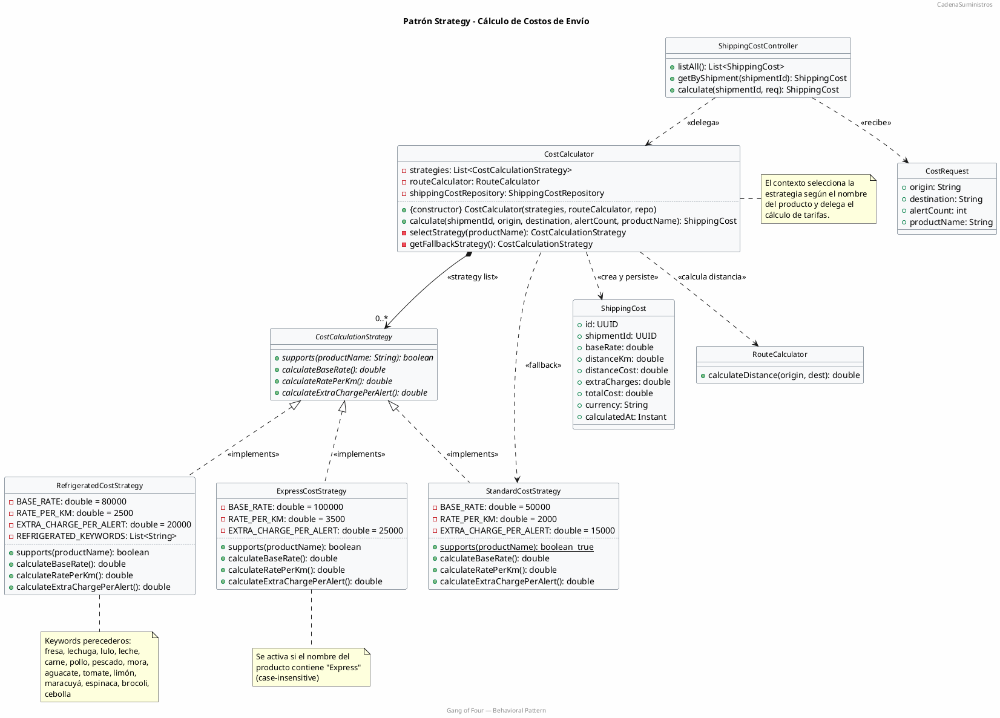
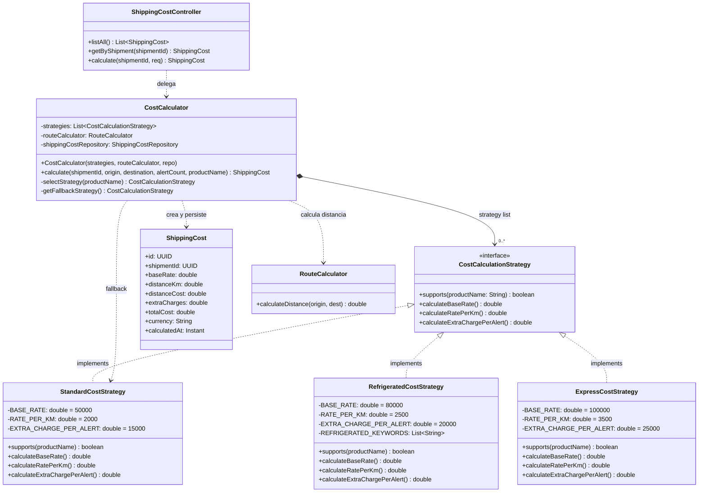

# Diagrama UML — Patrón Strategy

## Código PlantUML

## Diagrama renderizado

## Leyenda de relaciones

| Símbolo | Significado |
|---------|-------------|
| `▬▬▬▬▬▬▬▶` | Herencia / Implementación |
| `▬▬▬◆────` | Composición (tiene una colección de) |
| `- - - - ▶` | Dependencia / Uso |
