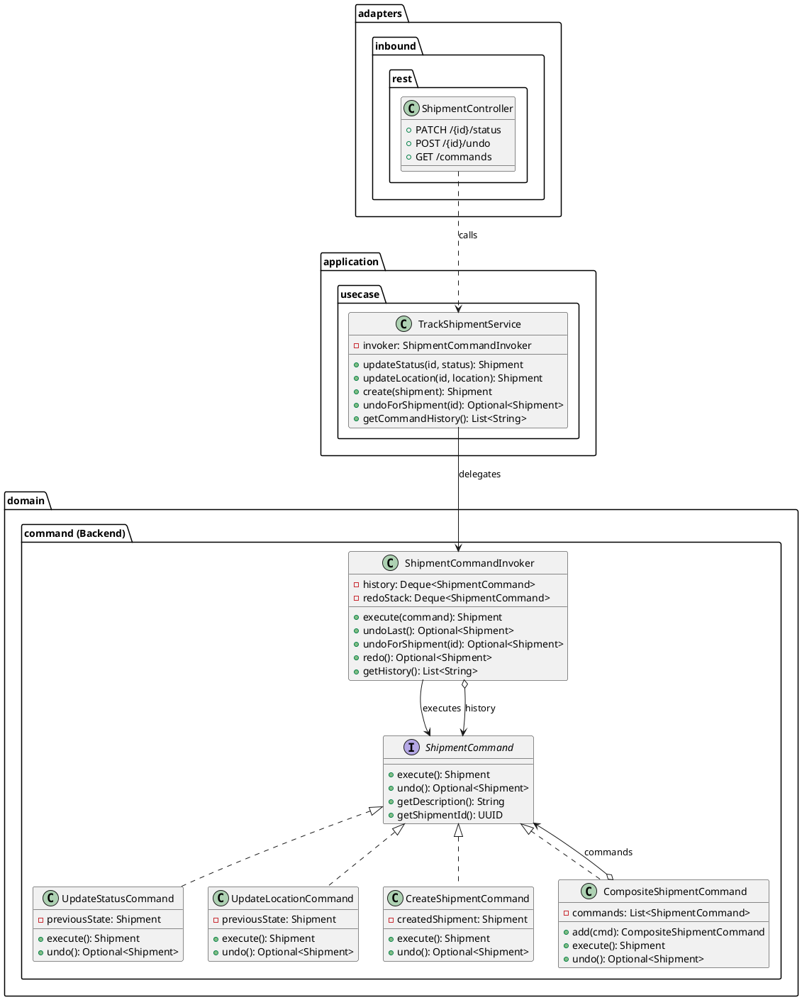
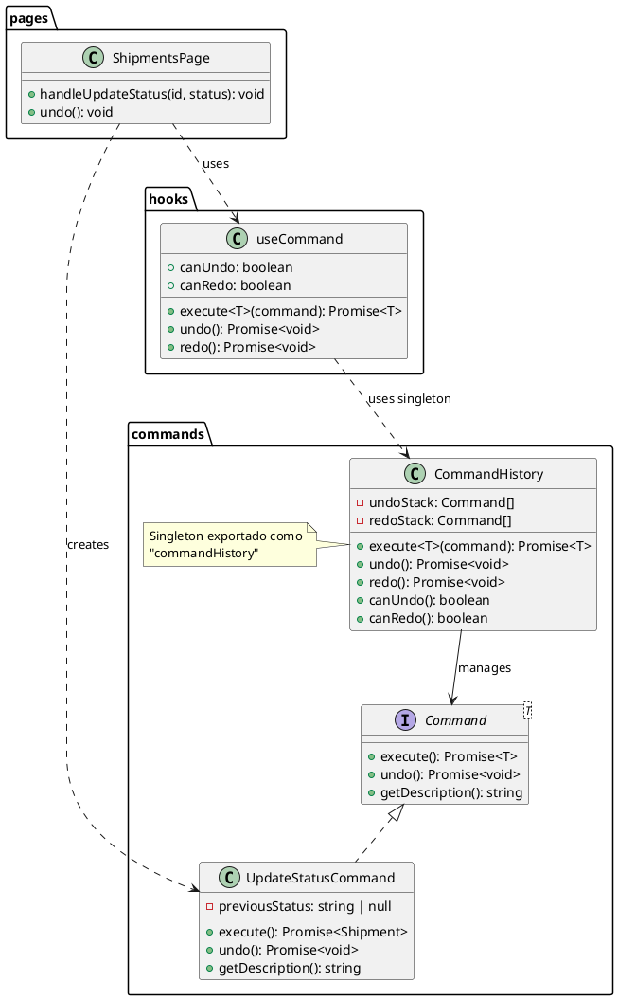
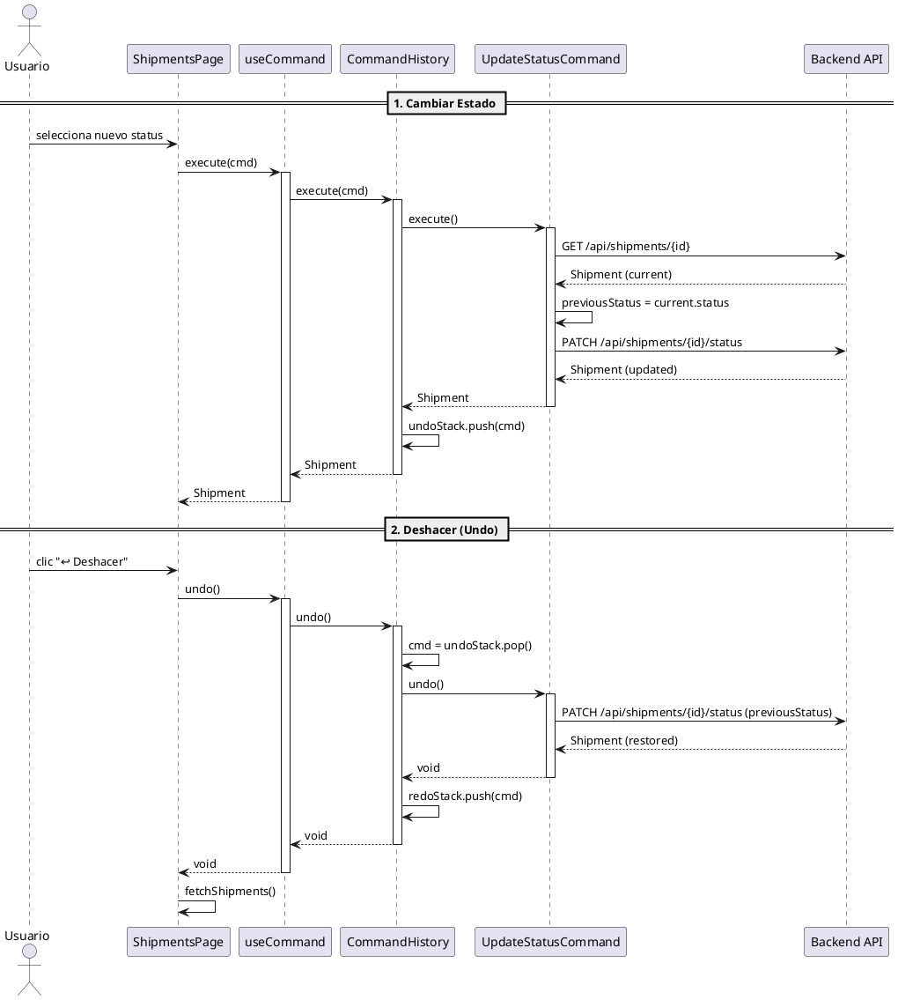
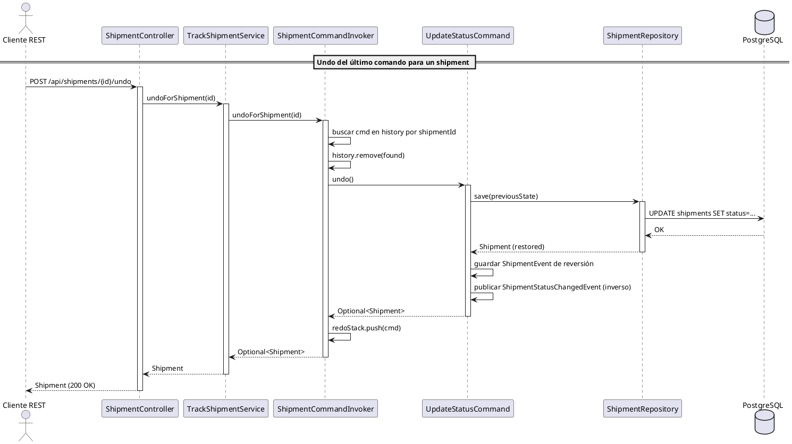
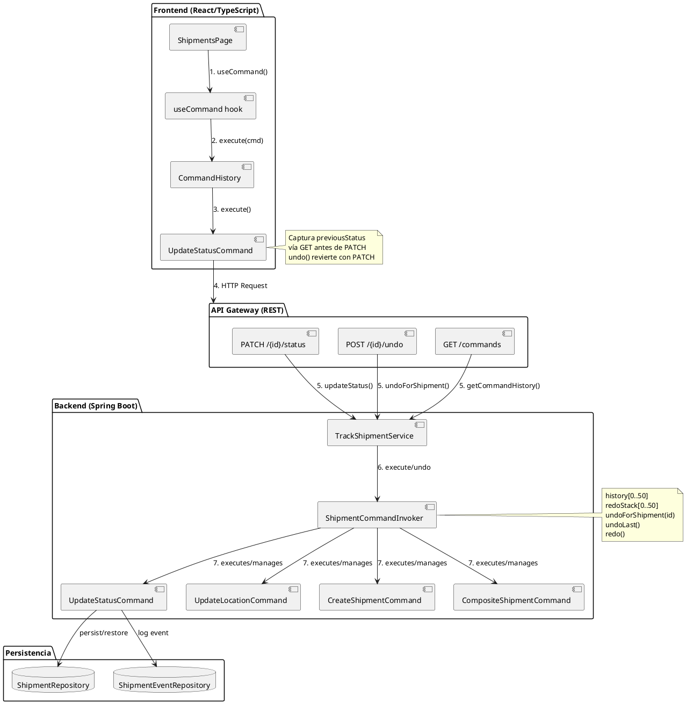

# UML del Patrón Command - CadenaSuministros



---

## Diagrama de Clases — Frontend Command



---

## Diagrama de Secuencia — Cambio de Estado con Undo



---

## Diagrama de Secuencia — Undo For Shipment (Backend)



---

## Diagrama de Componentes — Arquitectura Completa



---

## Descripción de los Diagramas

### 1. Diagrama de Clases — Backend
Muestra la estructura del patrón Command en el backend:
- `ShipmentCommand` es la interfaz que definen los 4 comandos concretos
- `UpdateStatusCommand`, `UpdateLocationCommand`, `CreateShipmentCommand` son comandos individuales
- `CompositeShipmentCommand` compone múltiples comandos (Composite pattern)
- `ShipmentCommandInvoker` mantiene el historial, ejecuta comandos y soporta undo/redo
- `TrackShipmentService` delega todas las operaciones en el Invoker
- `ShipmentController` expone endpoints para comandar desde REST

### 2. Diagrama de Clases — Frontend
Muestra la estructura del patrón Command en el frontend:
- `Command<T>` es la interfaz genérica
- `UpdateStatusCommand` captura el estado anterior y ejecuta/deshace vía API
- `CommandHistory` es el singleton que mantiene los stacks de undo/redo
- `useCommand` es el hook React que expone execute, undo, redo, canUndo, canRedo

### 3. Diagrama de Secuencia — Cambio de Estado con Undo
Flujo completo desde que el usuario cambia un estado hasta que puede deshacerlo:
1. Usuario selecciona nuevo estado → se crea `UpdateStatusCommand` y se ejecuta
2. El comando obtiene el estado actual, luego envía el PATCH
3. `CommandHistory` guarda el comando en el undo stack
4. Usuario hace clic en "Deshacer" → se ejecuta `command.undo()` que envía un PATCH inverso

### 4. Diagrama de Secuencia — Undo For Shipment
Flujo de deshacer desde el endpoint REST del backend:
1. `POST /api/shipments/{id}/undo` llega al controller
2. Busca el comando más reciente para ese shipment en el historial del Invoker
3. Ejecuta `undo()` que restaura el estado previo en DB y publica evento inverso

### 5. Diagrama de Componentes
Vista general de la arquitectura completa mostrando cómo frontend y backend se conectan a través de la API REST para implementar el patrón Command de extremo a extremo.

---

## Elementos UML Principales

| Elemento | Tipo | Descripción |
|----------|------|-------------|
| **ShipmentCommand** | Interface | Contrato para todos los comandos del backend |
| **UpdateStatusCommand** | ConcreteCommand | Cambia estado de un envío (con undo) |
| **UpdateLocationCommand** | ConcreteCommand | Cambia ubicación de un envío (con undo) |
| **CreateShipmentCommand** | ConcreteCommand | Crea un envío (undo = CANCELLED) |
| **CompositeShipmentCommand** | ConcreteCommand | Macro comando que agrupa subcomandos |
| **ShipmentCommandInvoker** | Invoker | Ejecuta comandos, mantiene historial, undo/redo |
| **Command<T>** | Interface | Contrato para comandos del frontend |
| **CommandHistory** | Invoker | Singleton con stacks de undo/redo (frontend) |
| **useCommand** | Hook | Hook React que expone el CommandHistory |

### Flujo de Ejecución

```
Cliente → ShipmentController → TrackShipmentService → ShipmentCommandInvoker.execute()
                                                          ↓
                                                    UpdateStatusCommand.execute()
                                                          ↓
                                                    ShipmentRepository.save()
                                                    EventRepository.save()
                                                    EventPublisher.publishEvent()
                                                          ↓
                                                    Retorna Shipment
```

### Flujo de Undo

```
Cliente → POST /{id}/undo → ShipmentController → TrackShipmentService.undoForShipment()
                                                          ↓
                                                    ShipmentCommandInvoker.undoForShipment()
                                                          ↓
                                                    UpdateStatusCommand.undo()
                                                          ↓
                                                    ShipmentRepository.save(previousState)
                                                    EventRepository.save(reverse event)
                                                    EventPublisher.publishEvent(inverse)
                                                          ↓
                                                    Retorna Shipment restaurado
```

---

## Ejecutar los Diagramas

Para visualizar los diagramas:
1. Copia el código entre los bloques ```plantuml
2. Pégalo en [PlantUML Online Editor](https://www.planttext.com)
3. O usa la extensión **PlantUML** en VS Code
