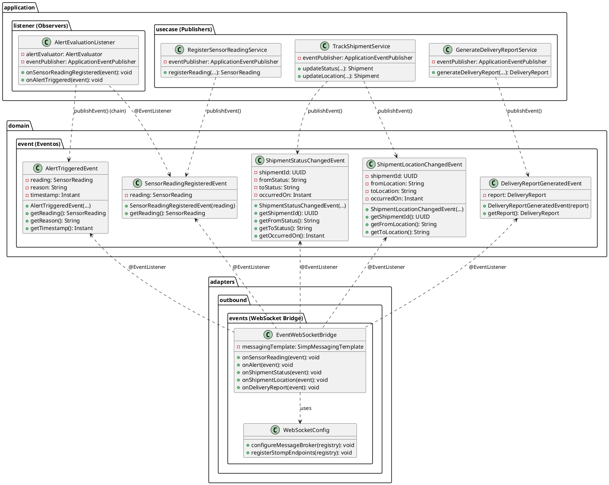
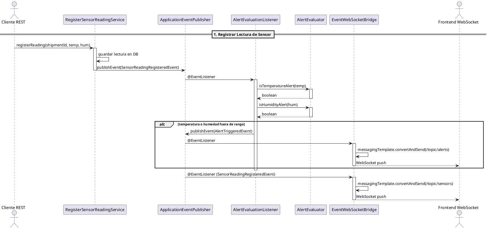
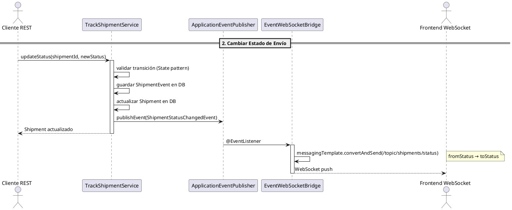
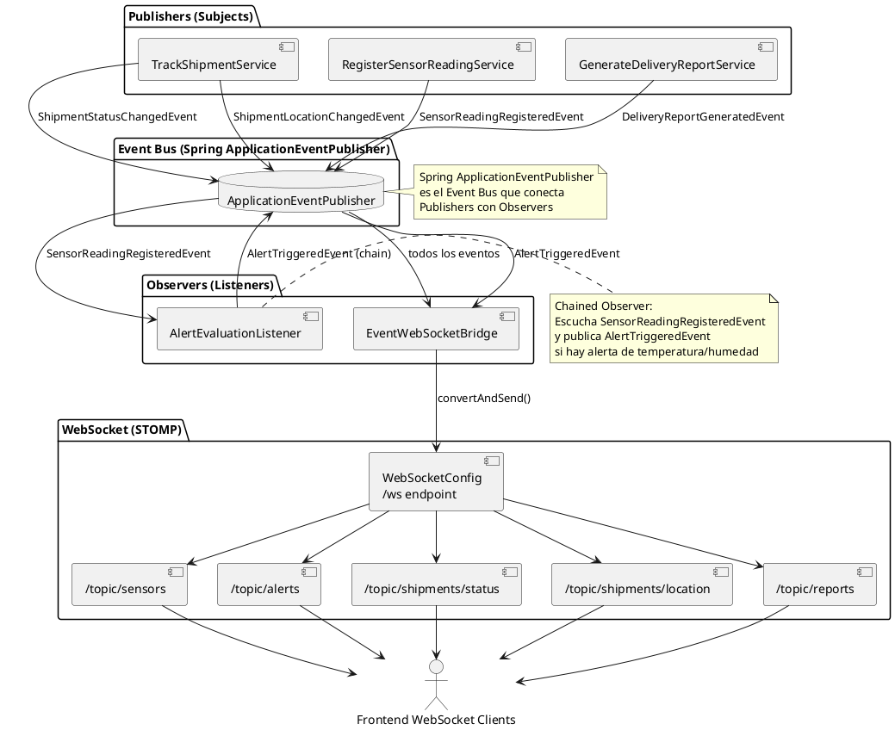

# UML del Patrón Observer - CadenaSuministros



---

## Diagrama de Secuencia — Flujo Completo de Eventos



---

## Diagrama de Secuencia — Cambio de Estado + WebSocket



---

## Diagrama de Arquitectura — Pub/Sub Completo



---

## Diagrama de Componentes — Canales WebSocket

```plantuml
@startuml
skinparam componentStyle uml2

' ============================================
' CANALES WEBSOCKET - TOPICS STOMP
' ============================================

package "EventWebSocketBridge" as bridge {
    component "onSensorReading" as h1
    component "onAlert" as h2
    component "onShipmentStatus" as h3
    component "onShipmentLocation" as h4
    component "onDeliveryReport" as h5
}

package "STOMP Topics" {
    collections "/topic/sensors" as t1 {
        [SensorReading JSON]
    }
    collections "/topic/alerts" as t2 {
        [Alert JSON]
    }
    collections "/topic/shipments/status" as t3 {
        [{from, to, shipmentId}]
    }
    collections "/topic/shipments/location" as t4 {
        [{from, to, shipmentId}]
    }
    collections "/topic/reports" as t5 {
        [DeliveryReport JSON]
    }
}

actor "Frontend" as frontend

h1 --> t1 : convertAndSend()
h2 --> t2 : convertAndSend()
h3 --> t3 : convertAndSend()
h4 --> t4 : convertAndSend()
h5 --> t5 : convertAndSend()

frontend --> t1 : subscribe()
frontend --> t2 : subscribe()
frontend --> t3 : subscribe()
frontend --> t4 : subscribe()
frontend --> t5 : subscribe()

note right of frontend
  Frontend se suscribe
  a los topics que necesita
  vía STOMP sobre WebSocket
end note

@enduml
```

---

## Descripción de los Diagramas

### 1. Diagrama de Clases
Muestra la arquitectura completa del patrón Observer:
- **Eventos (domain.event)**: 5 clases que representan cambios de estado en el dominio
- **Publishers (application.usecase)**: 3 servicios que emiten eventos vía `ApplicationEventPublisher`
- **Observers**: `AlertEvaluationListener` evalúa umbrales y encadena eventos; `EventWebSocketBridge` reenvía a WebSocket
- **WebSocketConfig**: Configuración STOMP para push en tiempo real

### 2. Diagrama de Secuencia — Sensor + Alertas
Flujo completo desde que se registra una lectura de sensor hasta que:
1. Se persiste la lectura
2. Se publica `SensorReadingRegisteredEvent`
3. `AlertEvaluationListener` evalúa umbrales de temperatura/humedad
4. Si hay alerta, se publica `AlertTriggeredEvent` (Observer encadenado)
5. `EventWebSocketBridge` reenvía ambos eventos a los topics STOMP
6. Frontend recibe push vía WebSocket

### 3. Diagrama de Secuencia — Cambio de Estado
Flujo cuando se actualiza el estado de un envío:
1. `TrackShipmentService` actualiza y persiste
2. Publica `ShipmentStatusChangedEvent`
3. `EventWebSocketBridge` reenvía a `/topic/shipments/status`

### 4. Diagrama de Arquitectura Pub/Sub
Vista general del sistema publicador/suscriptor con todos los eventos y canales.

### 5. Diagrama de Canales WebSocket
Muestra los 5 topics STOMP y qué handler de `EventWebSocketBridge` escribe en cada uno.

---

## Elementos UML Principales

| Elemento | Tipo | Descripción |
|----------|------|-------------|
| **ShipmentStatusChangedEvent** | Event | Cambio de estado de envío |
| **SensorReadingRegisteredEvent** | Event | Nueva lectura de sensor |
| **ShipmentLocationChangedEvent** | Event | Cambio de ubicación |
| **AlertTriggeredEvent** | Event | Alerta de temperatura/humedad |
| **DeliveryReportGeneratedEvent** | Event | Reporte de entrega generado |
| **TrackShipmentService** | Publisher | Publica eventos de envío |
| **RegisterSensorReadingService** | Publisher | Publica eventos de sensor |
| **GenerateDeliveryReportService** | Publisher | Publica eventos de reporte |
| **AlertEvaluationListener** | Observer | Evalúa umbrales, encadena alertas |
| **EventWebSocketBridge** | Observer | Puente a WebSocket en tiempo real |
| **WebSocketConfig** | Configuration | Configura STOMP en `/ws` |

### Flujo de Eventos

```
Publisher → ApplicationEventPublisher → @EventListener → Observer
                                                  ↓
                                         (acción: DB, WebSocket, etc.)
```

### Observer Encadenado

```
SensorReadingRegisteredEvent → AlertEvaluationListener
                                   ↓ (si temp/hum fuera de rango)
                              AlertTriggeredEvent → EventWebSocketBridge
                                                       ↓
                                                  /topic/alerts
```

---

## Ejecutar los Diagramas

Para visualizar los diagramas:
1. Copia el código entre los bloques \`\`\`plantuml
2. Pégalo en [PlantUML Online Editor](https://www.planttext.com)
3. O usa la extensión **PlantUML** en VS Code
