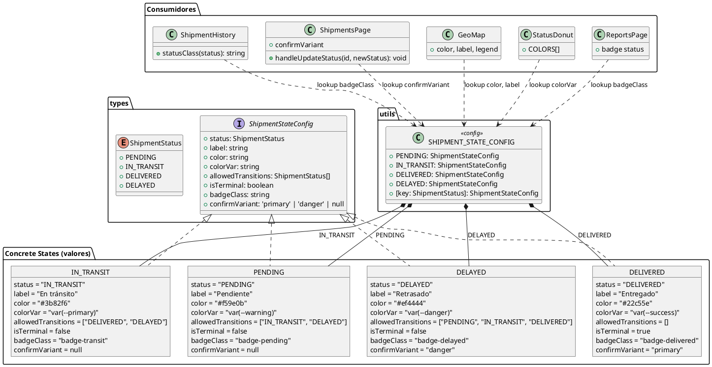
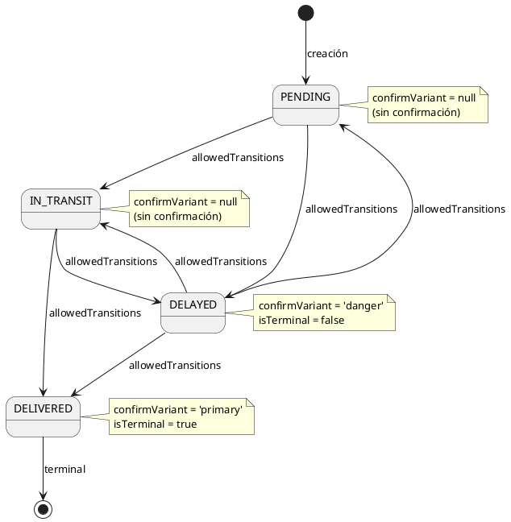
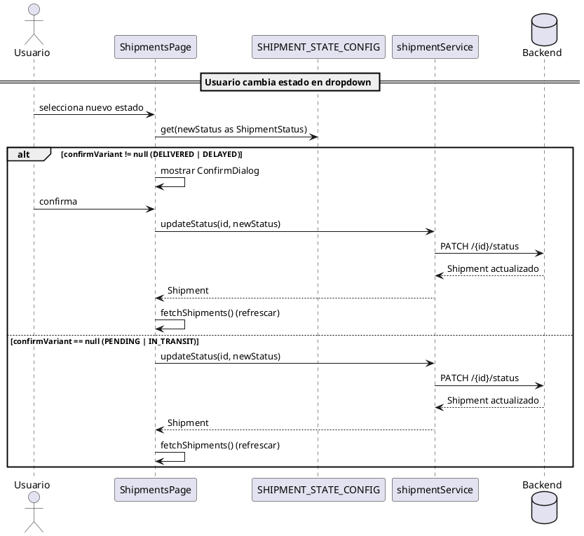

# UML del Patrón State - CadenaSuministros



---

## Diagrama de Transiciones de Estado



---

## Diagrama de Flujo — Cambio de Estado en UI



---

## Diagrama de Componentes — Cómo se consume el config

```plantuml
@startuml
skinparam componentStyle uml2

' ============================================
' CONSUMIDORES DE SHIPMENT_STATE_CONFIG
' ============================================

package "utils/constants.ts" {
    database "SHIPMENT_STATE_CONFIG" as config {
        [PENDING]
        [IN_TRANSIT]
        [DELIVERED]
        [DELAYED]
    }
}

package "Consumidores" {
    component "statusClass()\nShipmentHistory" as hist {
        note
            badgeClass lookup
        end note
    }
    component "confirmVariant\nShipmentsPage" as page {
        note
            ¿Mostrar diálogo?
            ¿Variante danger/primary?
        end note
    }
    component "color + label\nGeoMap" as geo {
        note
            Marcadores Leaflet
            Leyenda interactiva
        end note
    }
    component "colorVar\nStatusDonut" as donut {
        note
            Colores del gráfico
            circular
        end note
    }
    component "badgeClass\nReportsPage" as rpt {
        note
            Badge de estado
            en reportes
        end note
    }
}

' Flujo
config --> hist : badgeClass
config --> page : confirmVariant
config --> geo : color, label
config --> donut : colorVar
config --> rpt : badgeClass

@enduml
```

---

## Descripción de los Diagramas

### 1. Diagrama de Clases
Muestra la estructura del patrón State en el frontend. La interfaz `ShipmentStateConfig` define el contrato para cada estado. `SHIPMENT_STATE_CONFIG` es el mapa que contiene las 4 configuraciones concretas. Los componentes consumidores (`ShipmentHistory`, `ShipmentsPage`, `GeoMap`, `StatusDonut`, `ReportsPage`) consultan el config en lugar de usar condicionales.

### 2. Diagrama de Transiciones
Muestra el ciclo de vida completo de un envío:
- `PENDING` puede ir a `IN_TRANSIT` o `DELAYED`
- `IN_TRANSIT` puede ir a `DELIVERED` o `DELAYED`
- `DELAYED` puede recuperarse a `PENDING`, `IN_TRANSIT` o `DELIVERED`
- `DELIVERED` es estado terminal

### 3. Diagrama de Flujo
Ilustra el proceso cuando un usuario cambia el estado desde la UI. El config determina si se requiere confirmación (`confirmVariant`) y qué variante visual usar.

### 4. Diagrama de Componentes
Muestra cómo cada componente consumidor extrae exactamente la propiedad que necesita del config central, eliminando toda la duplicación anterior.

---

## Elementos UML Principales

| Elemento | Descripción |
|----------|-------------|
| **ShipmentStateConfig** | Interfaz que define la estructura de cada estado |
| **ShipmentStatus** | Enum de los 4 estados posibles |
| **SHIPMENT_STATE_CONFIG** | Mapa con las configuraciones concretas (Context) |
| **PENDING / IN_TRANSIT / DELIVERED / DELAYED** | Objetos con valores concretos (ConcreteState) |
| **ShipmentHistory** | Consumidor: lookup de badgeClass |
| **ShipmentsPage** | Consumidor: lookup de confirmVariant |
| **GeoMap** | Consumidor: lookup de color y label |
| **StatusDonut** | Consumidor: lookup de colorVar |
| **ReportsPage** | Consumidor: lookup de badgeClass |

### Relaciones UML

- `<|..` : Implementación de interfaz
- `*--` : Composición (el config contiene los estados)
- `..>` : Dependencia / lookup

---

## Ejecutar los Diagramas

Para visualizar los diagramas:
1. Copia el código entre los bloques \`\`\`plantuml
2. Pégalo en [PlantUML Online Editor](https://www.planttext.com)
3. O usa la extensión **PlantUML** en VS Code
